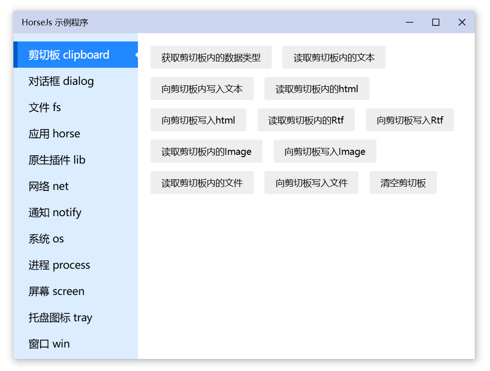

此项目正在积极开发中...

## HorseJs

- 使用HTML/JS/CSS创建更快速、更稳定的桌面应用。
- 使用更简单：开发者只在渲染进程内工作。
- 基于WebView2，可执行文件不依赖任何动态链接库且体积小于1M
- 不用适配多个平台，可以做到更小、更快、更易用、能力更大。

## 下载

[Release](https://github.com/xland/HorseJs/releases) （小于1M）

## 文档

- [快速入门](./Doc/start.md)
- [配置说明 config.json](./Doc/config.md)
- [全局对象 horse](./Doc/horse.md)
    - [剪切板 horse.clipboard](./Doc/clipboard.md)
    - [对话框 horse.dialog](./Doc/dialog.md)
    - [第三方库 horse.dll](./Doc/dll.md)
    - [文件系统 horse.fs](./Doc/fs.md)
    - [网络 horse.net](./Doc/net.md)
    - [通知 horse.notify](./Doc/notify.md)
    - [系统 horse.os](./Doc/os.md)
    - [进程 horse.process](./Doc/process.md)
    - [屏幕 horse.screen](./Doc/screen.md)
    - [托盘 horse.tray](./Doc/tray.md)
    - [窗口对象 horse.win](./Doc/win.md)
- [FAQ](./Doc/FAQ.md)

## 赞助
<table>
  <tr>
    <td align="center">
      
      
支付宝赞助

    </td>
    <td align="center">
      
      
微信赞助

    </td>
    <td align="center">
      
      
作者微信

    </td>
    <td align="center">
      
      
公众号：桌面软件

    </td>
  </tr>
</table>